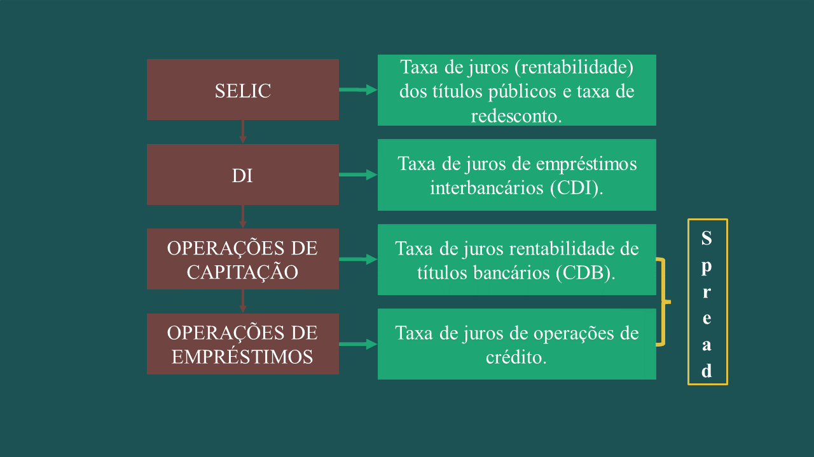
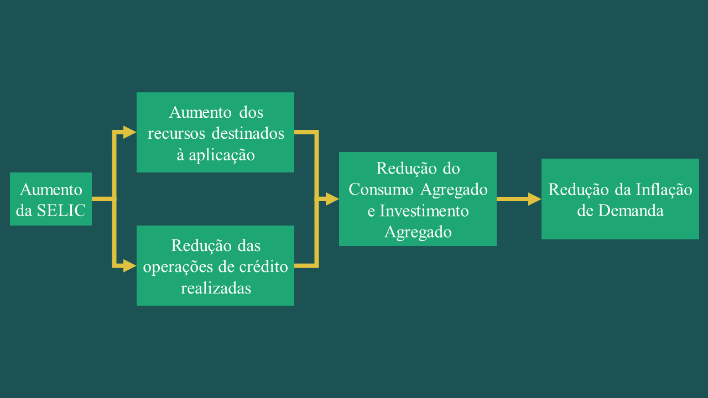

```{r xaringan-themer, include=FALSE, warning=FALSE}
# PACOTES UTILIZADOS: ----
library(xaringanthemer)
library(xaringanExtra)

# CONFIGURAÇÃO DA FONTE: ----
style_mono_light(base_color = '#1c5253',
                  text_font_size = '30px',
                  header_h1_font_size = '3rem',
                  header_h2_font_size = '2rem',
                  header_h3_font_size = '1.5rem')

# CONFIGURAÇÃO PADRÃO CHUNK: ----
knitr::opts_chunk$set(echo = F,
                      cache = T,
                      results = 'asis', 
                      warning = F, 
                      message = F, 
                      error = F, 
                      fig.align = 'center', 
                      out.width = '100%')

# RECURSOS DO SLIDE: ----
use_scribble()
use_search(show_icon = TRUE)
```


```{r}
# PACOTES NECESSÁRIOS:
library(magrittr, include.only = '%>%')
library(ggplot2)

# IMPORTAÇÃO DE DADOS:
taxa_di_anual_id <- 4389
taxa_selic_anual_id <- 432
spread_bancario_di <- 20783 
taxa_juros_di <- 20714
  
 
taxa_di_anual <- GetBCBData::gbcbd_get_series(id = taxa_di_anual_id,
                                               first.date = as.Date('1995-01-01'),
                                               last.date = Sys.Date())

taxa_selic_anual <- GetBCBData::gbcbd_get_series(taxa_selic_anual_id,
                                                 first.date = as.Date('1995-01-01'),
                                                 last.date = Sys.Date())

spread_bancario <- GetBCBData::gbcbd_get_series(spread_bancario_di,
                                                first.date = as.Date('1995-01-01'),
                                                last.date = Sys.Date())

taxa_juros <- GetBCBData::gbcbd_get_series(taxa_juros_di,
                                           first.date = as.Date('1995-01-01'),
                                           last.date = Sys.Date())


rm(taxa_di_anual_id,
   taxa_selic_anual_id,
   spread_bancario_di,
   taxa_juros_di)
```

## TÓPICOS ABORDADOS

  ---
  
</br>

- [**MATEMÁTICA FINANCEIRA**](#matematicafinanceira)

- [**TAXAS DE JUROS IMPORTANTES**](#taxadejurosimportantes)

- [**CONCEITO DE SPREAD BANCÁRIO**](#spreadbancaria)


---
class: inverse, center, middle 
name: matematicafinanceira

## REVISÃO: MATEMÁTICA FINANCEIRA


---
<div style="text-align: justify">

## REVISÃO: MATEMÁTICA FINANCEIRA

  ---

- Os juros capitalizados de maneira simples (**juros simples**) correspondem ao rendimento futuro 
gerados a partir da **incidência** apenas sobre o **valor presente** (capital inicial) associado:

$$J_n = VP . i . n$$
$J_n$ = Juros gerados em _n_ períodos

$VP$ = Valor Presente (capital inicial);

$𝑖$ = Taxa de Juros;

$𝑛$ = Número de Períodos.


---
<div style="text-align: justify">

## REVISÃO: MATEMÁTICA FINANCEIRA

  ---

- O valor total obtido após o período de rendimento é chamado de **valor futuro (VF)**. No caso do 
juros simples, tem-se:

$$VF_n = VP + J_n$$

$$VF_n = VP + VP.i.n$$
$VF_n$ = Valor Futuro após _n_ períodos.


- **Obs.**: Os juros simples quase não são utilizados na prática.


---
<div style="text-align: justify">

## REVISÃO: MATEMÁTICA FINANCEIRA

  ---

- Por sua vez, os juros capitalizados de maneira composta (**juros compostos**) correspondem ao rendimento
futuro que incide sobre o **valor presente** (capital inicial) empregado acrescido dos juros até o período 
anterior:

$$VF_1 = VP+VP.i = VP(1+i)$$
$$VF_2 = VF_1+VF_1.i = P(1+i)^2$$
$$VF_3 = VF_2+VF_2.i = P(1+i)^3$$
$$VF_n = VF_{n-1}+VF_{n-1}.i = P(1+i)^n$$


---
<div style="text-align: justify">

## RELAÇÃO COM MACROECONOMIA

  ---

- Com esta pequena revisão de matemática financeira já é possível realizar uma associação com o 
conceito de taxa de juros. Como visto, como os valores nominais representam poder de compra em 
períodos diferentes é necessário realizar uma correção da série;

- De fato, toda vez que estamos interessados em avaliar a variação de uma série monetária é 
necessário realizar esta correção monetária (**deflacionar ou inflacionar a série**).

- Isto nada mais é que um exercício simples de matemática financeira (ao se considerar o regime de 
capitalização composta).

---
<div style="text-align: justify">

## RELAÇÃO COM MACROECONOMIA

  ---

**EXEMPLO DE SÉRIE COM CORREÇÃO MONETÁRIA**

```{r , results = 'asis'}


library(magrittr)


library(kableExtra)


cronograma <- data.frame(
  
  a = c('Jan - 2021', 'Fev - 2021', 'Mar - 2021', 'Abr - 2021', 'Mai - 2021', 'Jun - 2021'),
  
  b = c('', '0,12%', '0,9%', '0,4%', '0,61%', '0,14%'),
  
  c = c('R$ 15', 'R$ 35', 'R$ 60', 'R$ 42', 'R$ 38', 'R$ 12'),
  
  d = c('R$ 15,33', 'R$ 35,72', 'R$ 60,69', 'R$ 42,32', 'R$ 38,05', 'R$ 12,00'))

knitr::kable(cronograma, 
             
             escape = FALSE,
    
             format = 'html',
             
             col.names = c('Data', 'Taxa de Inflação', 
                           
                           'Série Original', 'Série Deflacionada'),
             
             align = c('c', 'c', 'c', 'c')) %>%
  
  kable_styling(bootstrap_options = 'striped')
  

```

- Valores à preços de junho de 2021.


---
class: inverse, center, middle 
name: taxadejurosimportantes

## TAXAS DE JUROS IMPORTANTES


---
class: inverse

### BANCO CENTRAL DO BRASIL
<div style="text-align: justify">
  ---
  
- _Entidade de Administração Indireta_: Uma entidade de administração indireta 
é uma pessoa jurídica criada pelo Estado, por meio de lei específica, para 
desempenhar atividades de interesse público que não podem ser realizadas 
diretamente pela administração direta.

  - Possui personalidade jurídica própria, ou seja, é distinta do Estado e possui 
  autonomia administrativa e financeira.

  - Tem o objetivo de executar atividades especializadas e específicas, muitas 
  vezes de natureza empresarial, como serviços de saúde, educação, cultura, entre 
  outros.

  - Geralmente, as entidades de administração indireta são dotadas de patrimônio 
  próprio e funcionários contratados.
  
---
class: inverse

### BANCO CENTRAL DO BRASIL
<div style="text-align: justify">
  ---
  
- Assim, o Banco Central do Brasil é considerado uma entidade de administração 
indireta. Ele é uma autarquia federal, vinculada ao Ministério da Economia, 
responsável por formular e executar a política monetária, regular o sistema 
financeiro nacional e emitir moeda.
  

---
<div style="text-align: justify">

## TAXAS DE JUROS IMPORTANTES

  ---

</br>

- Existem diversas taxas de juros no Brasil. Entretanto, pode-se dizer a grosso modo que duas delas 
são especialmente importantes.

  - A **Taxa de Juros básica da economia brasileira (Selic)**;

  - A **Taxa de Depósito Interbancário (DI)**.
  
  
---
<div style="text-align: justify">

## TAXAS DE JUROS IMPORTANTES

  ---

- A taxa SELIC (Sistema Especial de Liquidação e Custódia) é entendida como taxa básica de juros 
pois:

  - Corresponde a taxa que remunera os títulos públicos (ou seja, representa a rentabilidade dos 
títulos públicos);

  - É o principal instrumento de política monetária do Banco Central do Brasil (BACEN) – Taxa de 
redesconto;

  - Ela é definida a cada 45 dias na reunião do COPOM (Comitê de Política Monetária).


---
<div style="text-align: justify">

## O BRASIL EM PERSPECTIVA

  ---

```{r grafico_selic}
# VISUALIZAÇÃO DOS DADOS:
taxa_selic_grafico <- taxa_selic_anual %>% 
  dplyr::rename('Data' = ref.date,
                'Selic' = value) %>% 
  ggplot2::ggplot() +
  ggplot2::geom_line(mapping = ggplot2::aes(x = Data, y = Selic),
                     colour = '#1c5253',
                     size = .5) +
  ggplot2::geom_point(mapping = ggplot2::aes(x = Data, y = Selic),
                      colour = '#1c5253',
                      size = .75) +
  ggplot2::scale_y_continuous(labels = scales::number_format(suffix = '%')) +
  ggplot2::labs(title = 'Taxa Selic (Meta Banco Central do Brasil)',
                x = 'Períodos',
                y = '(% ao Ano)',
                caption = 'Dados: Banco Central do Brasil.') +
  xaringanthemer::theme_xaringan(text_font_size = 15,
                                 title_font_size = 20) 

taxa_selic_grafico <- plotly::ggplotly(taxa_selic_grafico)

widgetframe::frameWidget(taxa_selic_grafico, width = '100%', height = '100%')
```


---
<div style="text-align: justify">

## TAXAS DE JUROS IMPORTANTES

  ---
  
- Em associação, os bancos usam a informação da Taxa SELIC para formarem uma outra taxa de juros 
(denominada de DI);

- Ao final do dia os bancos precisam “zerar” os respectivos caixas dado que o volume de recebimentos 
não é igual ao volume de pagamentos;

- Com isso há uma “troca de caixas” entre os bancos e a taxa do DI é a referência para estas 
operações.
 
 
---
<div style="text-align: justify">

## O BRASIL EM PERSPECTIVA

  ---

```{r grafico_di}
# VISUALIZAÇÃO DOS DADOS:
taxa_di_grafico <- taxa_di_anual %>% 
  dplyr::rename('Data' = ref.date,
                'DI' = value) %>% 
  ggplot2::ggplot() +
  ggplot2::geom_line(mapping = ggplot2::aes(x = Data, y = DI),
                     colour = '#1c5253',
                     size = .5) +
  ggplot2::geom_point(mapping = ggplot2::aes(x = Data, y = DI),
                      colour = '#1c5253',
                      size = .75) +
  ggplot2::scale_y_continuous(labels = scales::number_format(suffix = '%')) +
  ggplot2::labs(title = 'Taxa DI (Anualizada Base 252)',
                x = 'Períodos',
                y = '(% ao Ano)',
                caption = 'Dados: Banco Central do Brasil.') +
  xaringanthemer::theme_xaringan(text_font_size = 15,
                                 title_font_size = 20) 

taxa_di_grafico <- plotly::ggplotly(taxa_di_grafico)

widgetframe::frameWidget(taxa_di_grafico, width = '100%', height = '100%')
```

 
---
<div style="text-align: justify">

## O BRASIL EM PERSPECTIVA

  ---

```{r grafico_juros}
# VISUALIZAÇÃO DOS DADOS:
taxa_juros_grafico <- taxa_juros %>% 
  dplyr::rename('Data' = ref.date,
                'Juros' = value) %>% 
  ggplot2::ggplot() +
  ggplot2::geom_line(mapping = ggplot2::aes(x = Data, y = Juros),
                     colour = '#1c5253',
                     size = .5) +
  ggplot2::geom_point(mapping = ggplot2::aes(x = Data, y = Juros),
                      colour = '#1c5253',
                      size = .75) +
  ggplot2::scale_y_continuous(labels = scales::number_format(suffix = '%')) +
  ggplot2::labs(title = 'Taxa de Juros (Média das Operações de Crédito)',
                x = 'Períodos',
                y = '(% ao Ano)',
                caption = 'Dados: Banco Central do Brasil.') +
  xaringanthemer::theme_xaringan(text_font_size = 15,
                                 title_font_size = 20) 

taxa_juros_grafico <- plotly::ggplotly(taxa_juros_grafico)

widgetframe::frameWidget(taxa_juros_grafico, width = '100%', height = '100%')
```


---
class: inverse, center, middle 
name: #spreadbancaria

## CONCEITO DE SPREAD BANCÁRIO


---
<div style="text-align: justify">

## CONCEITO DE SPREAD BANCÁRIO

  ---

- Os bancos são chamados de intermediários financeiros, isto é, eles captam recursos de agentes 
superavitários e realocam para agentes deficitários através de suas operações de crédito;

</br>

- Por isso os bancos são instituições importantes, eles viabilizam os investimentos aumentando a 
produção de uma determinada economia.


---
class: inverse
<div style="text-align: justify">

## CONCEITO DE SPREAD BANCÁRIO

  ---

```{r, out.width= '90%'}


```


---
<div style="text-align: justify">

## CONCEITO DE SPREAD BANCÁRIO

  ---

- Quando os bancos realizam operações de captação eles pagam juros aos agentes superavitários (para 
estimular que a operação seja realizada);

- De outro lado, quando os bancos emprestam dinheiro eles cobram juros (devido ao pagamento de custos 
administrativos, lucro e risco).

- Obviamente, os juros pagos pelos bancos nas operações de captação são menores que os juros cobrados 
nas operações de empréstimos. Esta diferença entre taxas é chamada de spread bancário.  


---
class: inverse
<div style="text-align: justify">

## CONCEITO DE SPREAD BANCÁRIO

  ---

```{r, out.width= '90%'}





```


---
## O BRASIL EM PERSPECTIVA

  ---

<div style="text-align: justify">

```{r grafico_spread}
# VISUALIZAÇÃO DOS DADOS:
spread_bancario_grafico <- spread_bancario %>% 
  dplyr::rename('Data' = ref.date,
                'SPREAD' = value) %>% 
  ggplot2::ggplot() +
  ggplot2::geom_line(mapping = ggplot2::aes(x = Data, y = SPREAD),
                     colour = '#1c5253',
                     size = .5) +
  ggplot2::geom_point(mapping = ggplot2::aes(x = Data, y = SPREAD),
                      colour = '#1c5253',
                      size = .75) +
  ggplot2::scale_y_continuous(labels = scales::number_format(suffix = '%')) +
  ggplot2::labs(title = 'Spread Bancário (Médio das Operações de Crédito)',
                x = 'Períodos',
                y = '(P.P.)',
                caption = 'Dados: Banco Central do Brasil.') +
  xaringanthemer::theme_xaringan(text_font_size = 15,
                                 title_font_size = 20) 

spread_bancario_grafico <- plotly::ggplotly(spread_bancario_grafico)

widgetframe::frameWidget(spread_bancario_grafico, width = '100%', height = '100%')
```

---
class: inverse
<div style="text-align: justify">

## IMPACTO DA SELIC NA INFLAÇÃO DE DEMANDA

  ---

```{r, out.width= '90%'}





```


